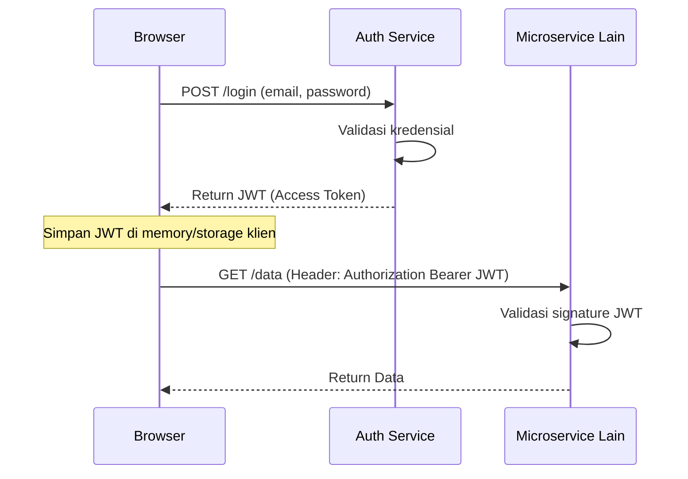
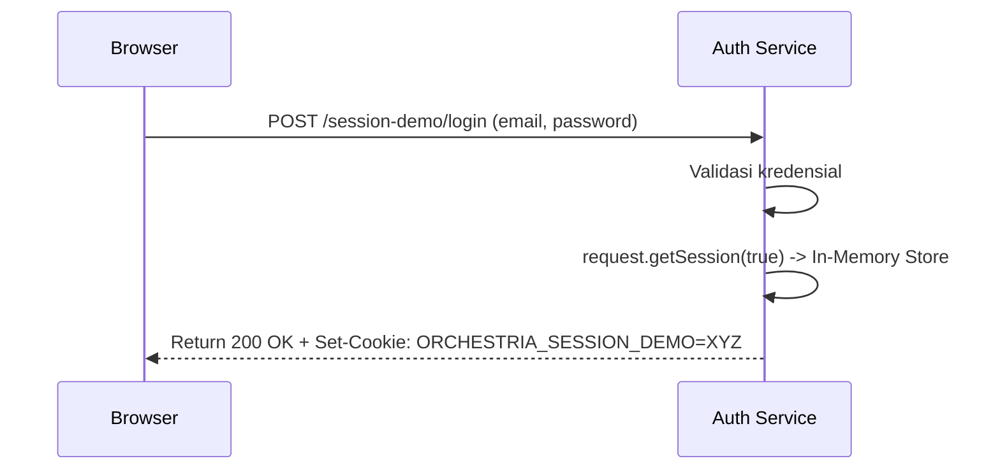
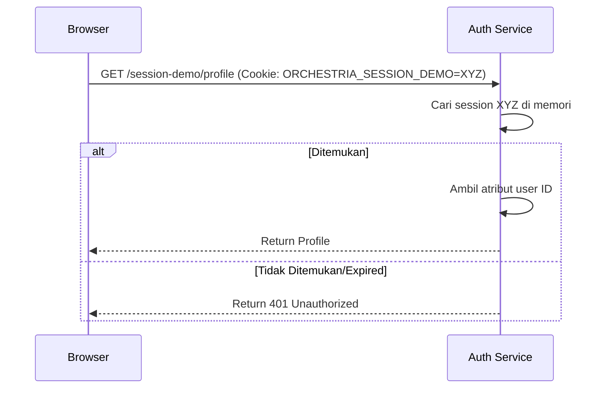
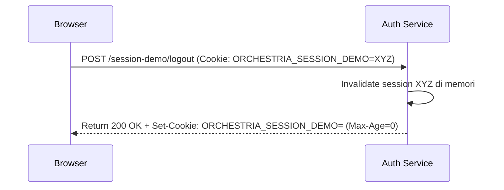

# Stateful HTTP Session vs Stateless JWT

Dokumen ini menjelaskan dua mekanisme autentikasi utama yang digunakan dalam pengembangan aplikasi web dan bagaimana Orchestria mengimplementasikan keduanya.

## 1. Definisi Stateless (JWT)
**Stateless Authentication** adalah metode di mana server tidak menyimpan status (state) login dari pengguna. Setiap permintaan (request) dari klien (browser/mobile) wajib membawa token (biasanya JSON Web Token / JWT) yang secara mandiri berisi identitas pengguna dan informasi masa aktif (expiration).
- Server hanya memvalidasi *signature* kriptografis JWT tanpa perlu melihat ke database atau memori server.

## 2. Definisi Stateful (HTTP Session)
**Stateful Authentication** adalah metode di mana server menyimpan status (state) pengguna yang sedang login di dalam memori server, *database*, atau memori terdistribusi (seperti Redis). Klien hanya diberikan sebuah token unik yang tidak berarti (opaque token) seperti `JSESSIONID`, yang dikirimkan via *cookie*.
- Setiap permintaan dari klien mencocokkan cookie tersebut dengan data di memori server untuk mengetahui siapa pengguna yang mengakses.

## 3. Implementasi Utama Orchestria
Sistem **utama** Orchestria dibangun menggunakan arsitektur **Stateless JWT**.
- Saat login, pengguna menerima `accessToken` (JWT).
- Frontend menyimpan JWT secara aman di memori.
- Autentikasi dilakukan via `Authorization: Bearer <token>`.
- **Alasan:** Orchestria dirancang dengan arsitektur microservices (`auth-service`, `organization-service`, `notification-report-service`). Pendekatan stateless (JWT) menghilangkan kebutuhan *shared database/cache* untuk sesi, sehingga microservices dapat menskalakan diri (scale-out) secara independen. JWT juga lebih mudah ditransmisikan antar microservice melalui *API Gateway*.

## 4. Implementasi Session Demo
Untuk tujuan pembelajaran/demonstrasi, Orchestria menyertakan endpoint terisolasi: `/api/auth/session-demo/**` yang berjalan pada metode **Stateful HTTP Session**.
- Saat login demo, backend membuat *session* menggunakan Tomcat in-memory (disimpan di `auth-service`).
- Browser menerima *cookie* HTTP-Only `ORCHESTRIA_SESSION_DEMO`.
- Data `userId` dan status autentikasi disimpan di RAM server (Memory).

### Batasan Memori dan Kebutuhan Multi-Instance
Karena session disimpan di memori satu instance `auth-service`:
- Jika `auth-service` direstart, seluruh sesi login demo akan hilang.
- Jika Orchestria di-deploy menggunakan beberapa instance `auth-service` (Horizontal Scaling) di balik *Load Balancer* tanpa konfigurasi *Sticky Session*, pengguna dapat mengalami *random logout* karena permintaannya ditangani oleh instance yang berbeda yang tidak memiliki sesi di memorinya.
- Untuk mengatasi masalah pada multi-instance, aplikasi stateful level produksi memerlukan *shared session storage* seperti **Redis** atau **Hazelcast** (Spring Session Redis).

## 5. Tabel Perbandingan

| Fitur | Stateful (HTTP Session Demo) | Stateless (JWT Orchestria) |
| --- | --- | --- |
| Penyimpanan | Memori Server (`auth-service`) | Klien (Browser/Aplikasi Mobile) |
| Token Klien | Cookie (`ORCHESTRIA_SESSION_DEMO`) | JWT string (`Authorization` header) |
| Integritas Data | Dicek langsung di memori/DB server | Cryptographic Signature (HMAC/RSA) |
| Revocation (Cabut akses) | Mudah (tinggal invalidate session di server) | Sulit (butuh JWT Blacklist / Token versi pendek & Refresh Token) |
| Skalabilitas | Terbatas (Butuh Redis/Shared Storage untuk multi-instance) | Sangat Tinggi (Bebas memproses request di instance mana pun) |
| Proteksi CSRF | Wajib (karena Cookie terkirim otomatis) | Tidak Wajib jika menggunakan Custom Header (`Authorization`) |

## 6. Diagram Alir (Sequence Diagrams)

### JWT Stateless Login (Operasional Orchestria)

### Stateful Session Login (Demo)

### Request dengan Session Cookie

### Session Logout/Expiry

