# 15. System Flowcharts

Dokumen ini menjadi sumber flowchart otomatis Orchestria. Diagram menggunakan Mermaid dan dapat dirender langsung oleh GitHub, VS Code, atau Mermaid Live Editor.

## 1. Arsitektur Sistem

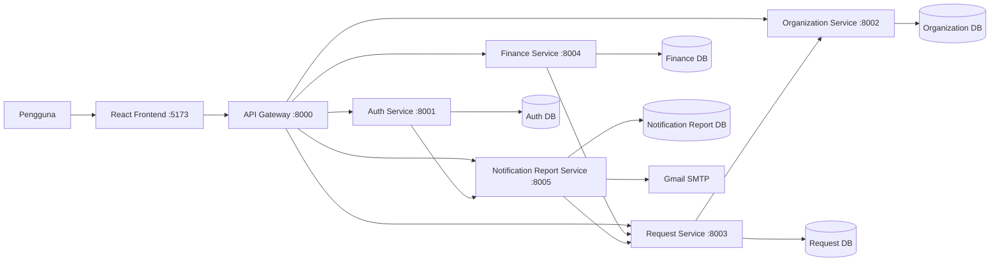

## 2. Login JWT, OTP, MFA, dan Trusted Device

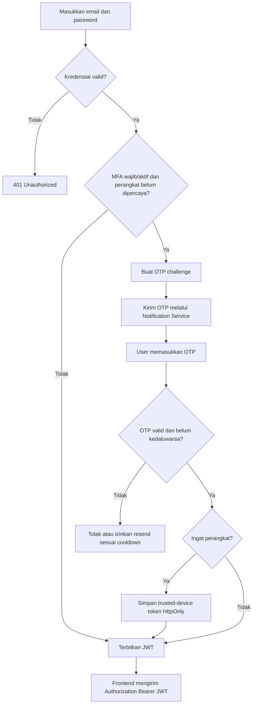

## 3. Stateful Session Demo

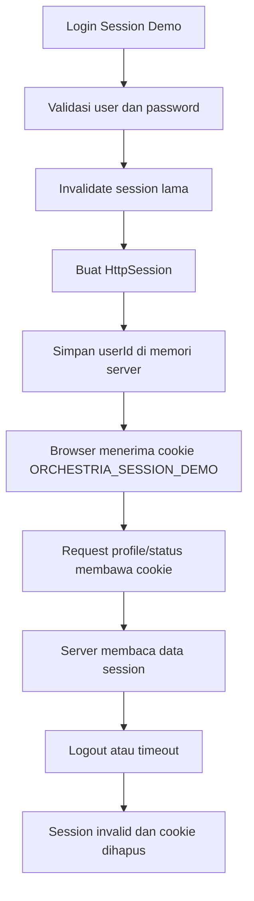

## 4. Pengajuan dan Approval

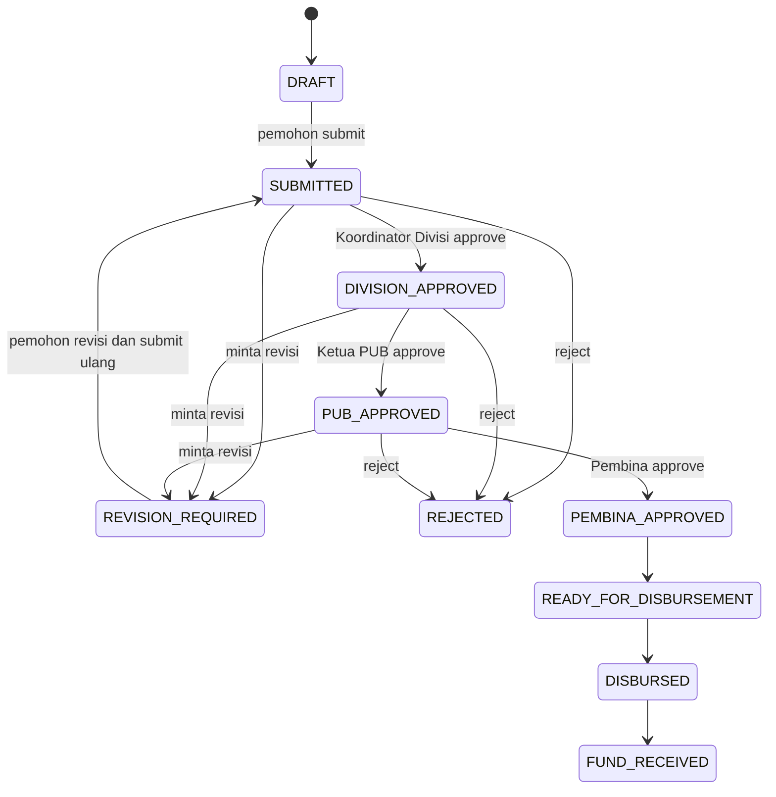

## 5. Finance dan Settlement

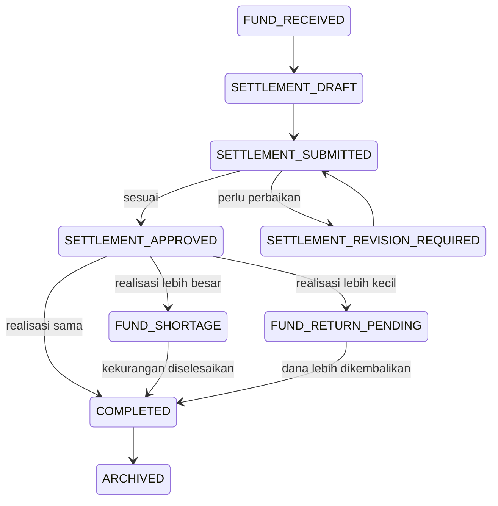

## 6. Tugas Divisi

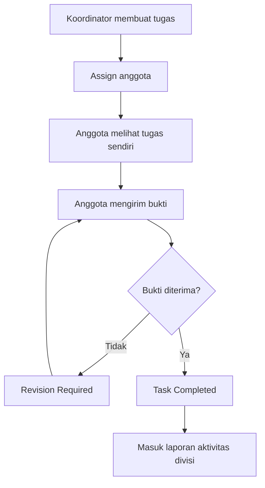

## 7. Peminjaman Aset

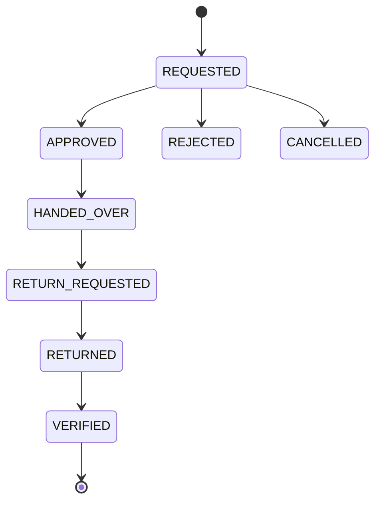

## 8. Piket dan Kebersihan

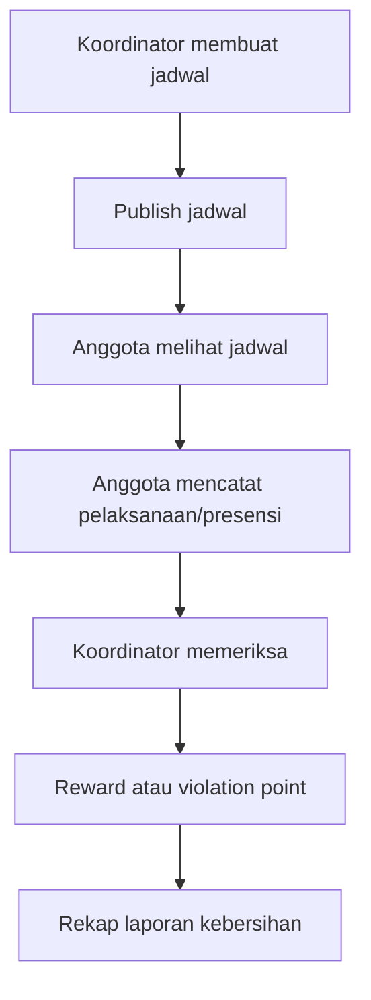

## 9. English Activity

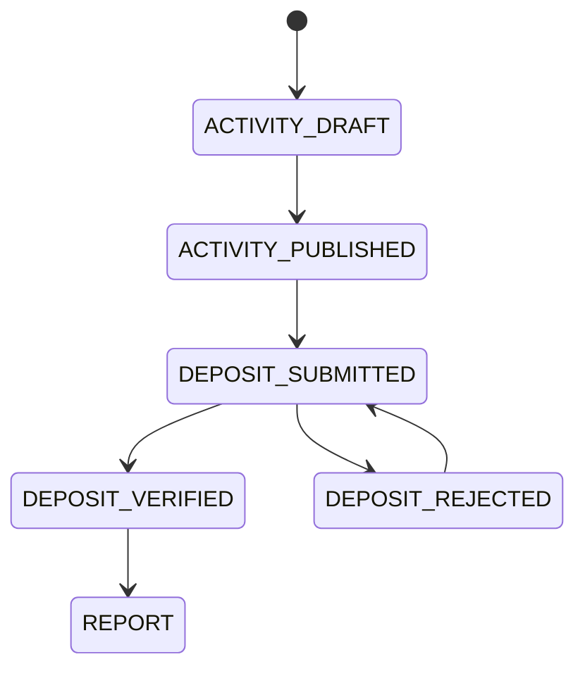

## 10. HUMAS dan Konten Publik

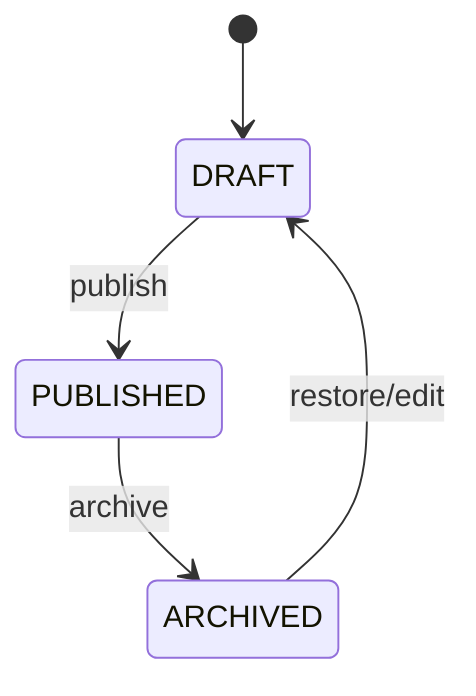

## 11. Notification, Scheduler, dan Report

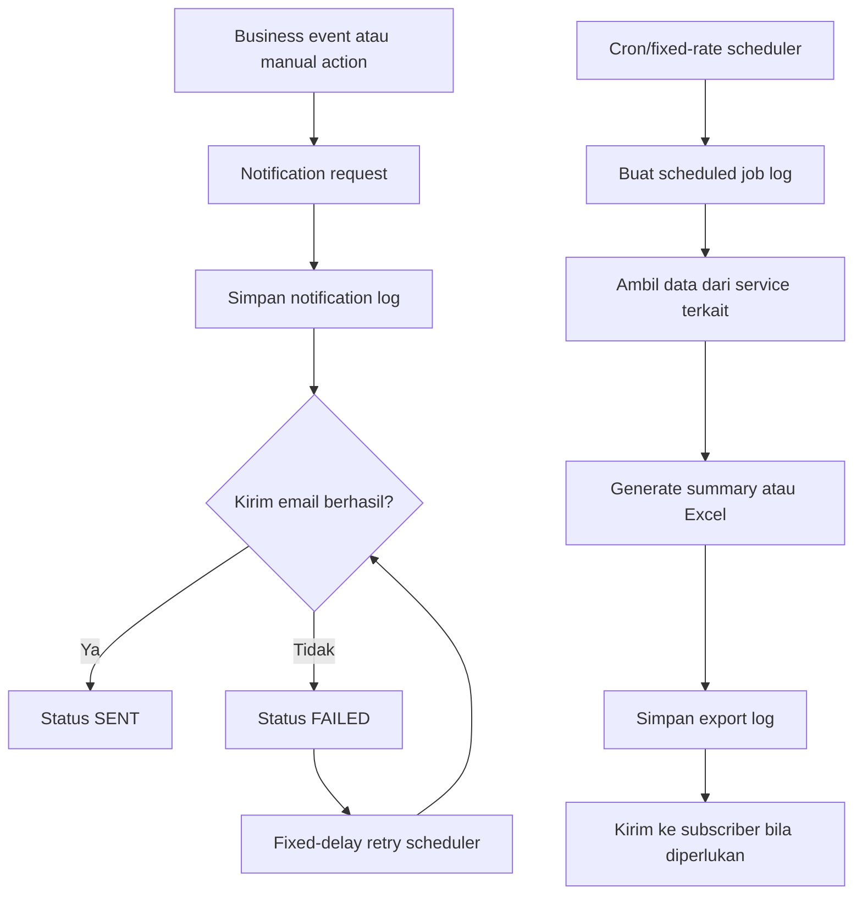

## 12. Model Role dan Position Final

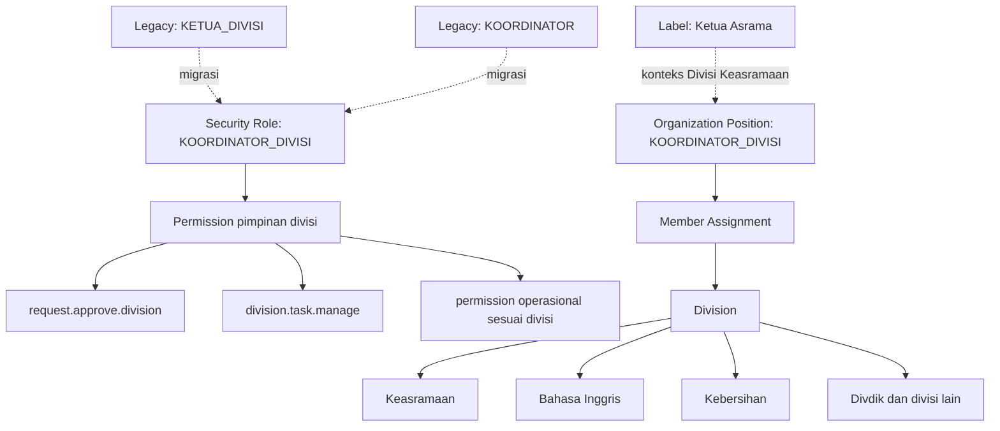
